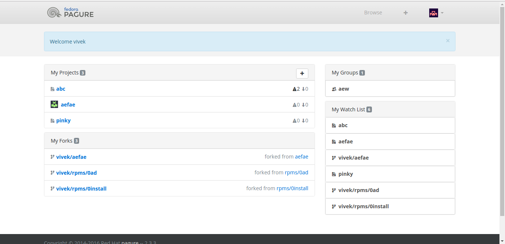

Not long ago, [Gaurav](https://pagure.io/user/aavrug) added watch feature on pagure. But, It had one thing missing from it: a user could not see what all projects he/she is watching. So, with pull request [#1158](https://pagure.io/pagure/pull-request/1158), i tried to solve that problem.

For those of you are not aware of this feature, a user can now subscribe for emails for development of a project. He/She will receive emails for any changes on the issue tracker or if anything happens in any pull request. By default, the admin of a project is watching the project. However, if he wishes, he can unwatch it and he won't receive emails for that project anymore. This can help in situations when the user is admin of a lot of projects and is no longer interested in some of them.

I won't go in details of how this was implemented since, it involves simple function calls and minor addition in the UI (plus, there is a link to the PR). I will, however, attach screenshot of how it will look, when it will be live on [pagure.io](http://pagure.io).

