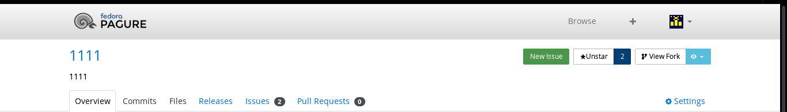
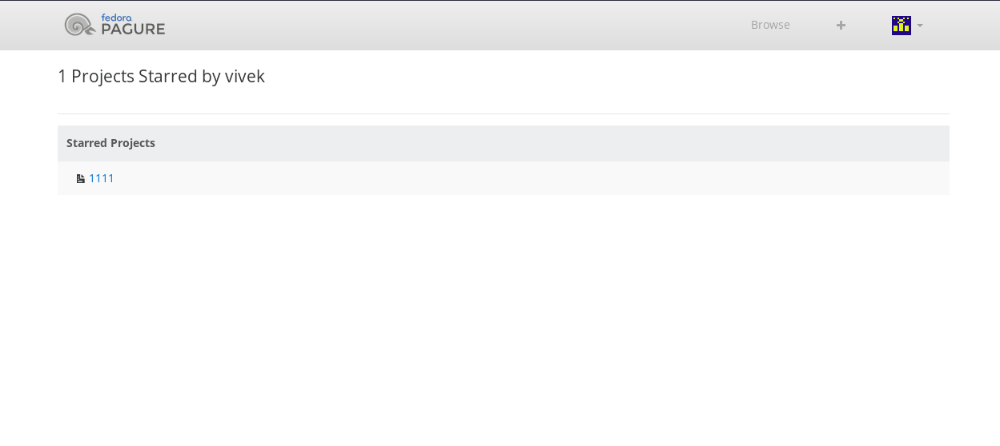
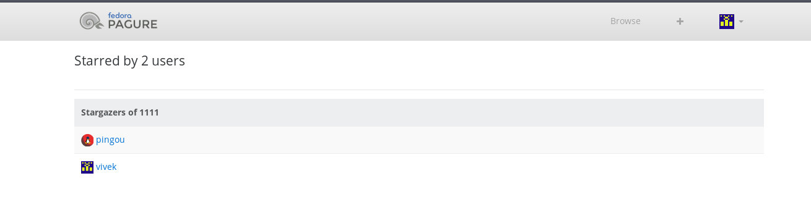

This feature was marked as "wishful" and it was supposed to be a low priority but i implemented it out of frustration. This should be there in the next feature release.

Star feature is already there on github and gitlab. I use this feature on github a lot. If I like an open source project, i star it. You also have a list of all the projects which you have starred which can be helpful if you have come across a project sometime ago and had starred it and you want to know more about it (given that you don't exactly remember the name, otherwise you can just search). Also, if the project author/maintainer is anything like me, he would love to see the star count rising.

For sometime now, i had been asking people who use pagure often (and hopefully like pagure) to star it on github. The star count of pagure was 96 at the time i started my work on star project feature. Last year, at this time, it was in late 60s.

If you star a project on github, your followers come to know that you have liked a project. They can see that on their github homepage. If they see the project, like it, you already have helped pagure reach more people with almost zero effort. I can't see one good reason if you like a project that you won't star it.

Pagure doesn't have the follow feature and i am not sure it will have in near future. This means the star project won't have it's full effect. But, one can star a project, there is a star count, there is a list of people who have starred, there is a list of starred projects of a user.

Here is how you can use this feature:

1. Log in to pagure and go to a project's home page.
2. There is a star button, just beside the fork button. It has a star count just beside it.
3. Star it if you like the project.

Here is where you will find your starred projects:

1. Log in to pagure.
2. The drop down on the top right corner will be "My Stars"

Here is where you can see who all have starred a particular projects:

1. Right beside the star button on repo page, we have a star count which actually links to a page which lists all the users who have starred the project.

