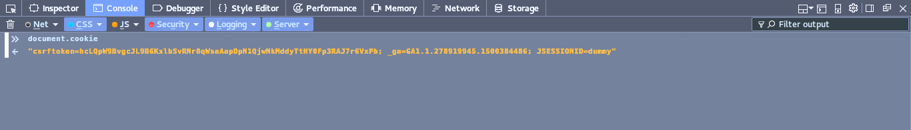
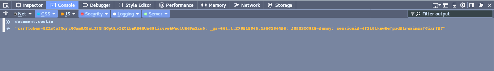

At my day job, i had to implement websockets and thus authentication of the websocket connection came up. There were two different types of clients but, the authentication for browser client was the biggest headache.

For a normal HTTP request, we use cookies for authentication of a user. Websocket protocol in itself doesn't define how a websocket connection should be authenticated. According to [RFC 6455, under section 10.5](https://tools.ietf.org/html/rfc6455#page-53):

```
   This protocol doesn't prescribe any particular way that servers can
   authenticate clients during the WebSocket handshake. The WebSocket
   server can use any client authentication mechanism available to a
   generic HTTP server, such as cookies, HTTP authentication, or TLS
   authentication.
```

So, the first thing that comes to mind is: Why not use the same cookies that we use for an HTTP request? I thought the same too but, eventually, decided to use token based authentication.

**Why not use the cookie?** We are using Django for our main web application. Django and WSGI based python frameworks in general, are not built for long lived connections. So, for websockets we are using Tornado.

In Django, by default, cookies are not readable by javascript. They are marked as HTTP only and thus the browser uses the cookie only for making http/https requests to the origin server. It can be turned off by using:

```
SESSION_COOKIE_HTTPONLY = False
```



The above image is when you have _SESSION\_COOKIE\_HTTPONLY = True_ .



This is when you set SESSION\_COOKIE\_HTTPONLY  to False. The \`\`\`sessionid\`\`\` is the one which will be used by the server to identify the user.

The main benefit of not exposing sessionid to js in the browser is that it if someone successfully performs a XSS attack they won’t be able to hijack the session. Setting the cookie to be not http only would have been the easiest option for me but, as it was not recommended, i went for token based authentication.

**Token based authentication**

For token based authentication to work, the Django server will have to generate a token on every request (for the endpoints which requires the websocket connection). Once the browser gets the token, it can initiate a websocket connection to the tornado server. While opening the websocket connection, the browser will send the token as well. On the server side, there should be a common store where Django can store the token and Tornado can retrieve the token to verify the request.

Generating the token on server side for multiple views can be done by making a python decorator. But, if you are making a decorator and want to pass on a variable to the original function itself, you will have to add an extra parameter on the function to receive the variable's value. This was a big task and would have meant a lot of changes across the project. Instead, i went on to make project wide template tags.

**Making a project wide template tag in django for creating tokens**

1. Create a folder under the project's main directory and create two files: \_\_init\_\_.py and create\_ws\_tokens.py
2.  In create\_ws\_tokens.py, you can put something like this.: \[code language="python"\] import uuid import json import datetime
    
    from django import template from project\_name import redis\_conn
    
    register = template.Library()
    
    @register.simple\_tag(takes\_context=True) def create\_ws\_token(context): request = context\['request'\] if not request.user.is\_authenticated(): return 'Not authed' user = request.user.username current\_time = datetime.datetime.strftime( datetime.datetime.utcnow(), "%d:%m:%Y:%H:%M:%S" ) token = 'wstoken' + uuid.uuid4().hex output = { 'user': user, 'time': current\_time } redis\_conn.set(token, json.dumps(output)) return token
    
    \[/code\]
3. Put the following snippet inside the Templates -> Options in settings of the project. \[code language="python"\] 'libraries': { 'create\_ws\_token': 'project\_name.templatetags.create\_ws\_token', }, \[/code\]
4. Now to use this template tag in any template, you will need to load it.  and \[code language="javascript"\] <script>     var token = '';     if (token.startsWith('wstoken')) {         socket(token);     } </script> \[/code\]

socket is a function which is defined in other js file which creates a websocket connection.

\[code language="javascript"\]

ws = create\_ws("ws://localhost:8080/wsb?ws\_token="+ws\_token);

\[/code\]

From tornado side, we need to get the ws\_token and query redis for a verification.

\[code language="python"\]

def open(self): ''' Called by tornado when a new connection opens up ''' self.user = None if 'ws\_token' in self.request.arguments: token = self.request.arguments\['ws\_token'\]\[0\] self.user = self.authenticate(token) if self.user: tsockets.add\_socket(self.user, self) print 'New connection from browser!' else: self.close() else: self.close()

\[/code\]

The authenticate method would be like:

\[code language="python"\]

def authenticate(self, token): ''' Check for authentic token in redis ''' inredis = self.application.redis\_conn.get(token) if inredis: inredis = json.loads(inredis) self.application.redis\_conn.delete(token) current\_time = datetime.datetime.utcnow() valid\_time = current\_time - datetime.timedelta(seconds=20) inredis\_time = datetime.datetime.strptime( inredis\['time'\], "%d:%m:%Y:%H:%M:%S" ) if valid\_time <= inredis\_time: return inredis\['user'\] return False

\[/code\]

I chose redis because, Tornado is a single threaded server and connecting to db, if it's not async will result in a blocking connection which means the real time features will get affected.

That's it.
